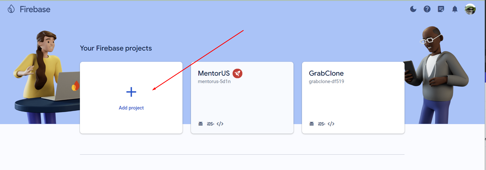
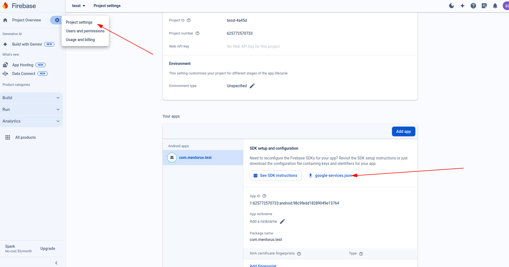
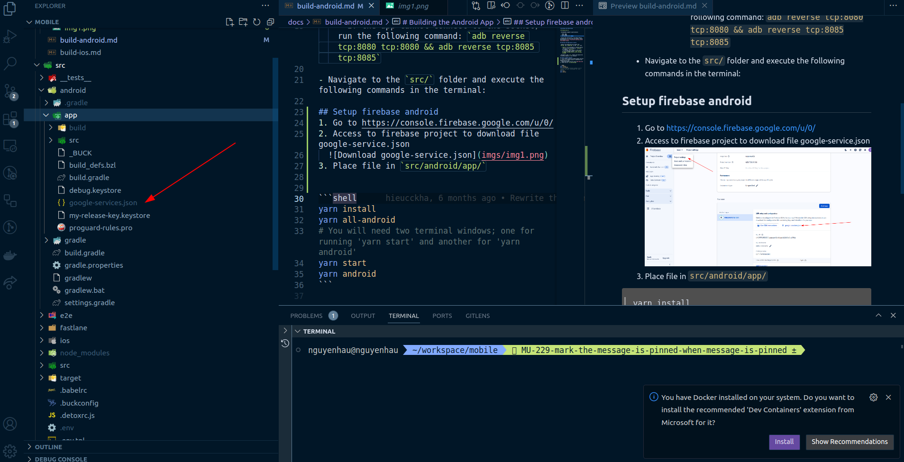

# Building the Android App

**Prerequisites:**

- Recommended computer specifications:

  - RAM: 16GB
  - Disk: 80GB
  - OS: Ubuntu 20.04 (Yammy) or window

- Follow the instructions in the React Native documentation to set up the environment: [Setup Environment](https://reactnative.dev/docs/0.70/environment-setup?guide=native&os=windows).

## Running the Application Locally

- Obtain the backend URL and replace the `API_URL` and `SOCKET_URL` in the `.env` file:

  - **Note:** If the backend is running locally,
    - Use the local IP instead of `localhost`, for example, `127.0.0.1`.
    - If the app cannot connect to the socket, run the following command: `adb reverse tcp:8080 tcp:8080 && adb reverse tcp:8085 tcp:8085`

- Navigate to the `src/` folder and execute the following commands in the terminal:

## Setup firebase android
1. Go to https://console.firebase.google.com/u/0/
2. Create new firebase project
      **note**: package name must be similar to  `com.mentorus`
3. Access to firebase project to download file google-service.json
  
1. Place file in `src/android/app/`
  
   

```shell
yarn install
yarn all-android
# You will need two terminal windows; one for running 'yarn start' and another for 'yarn android'
yarn start
yarn android
```
